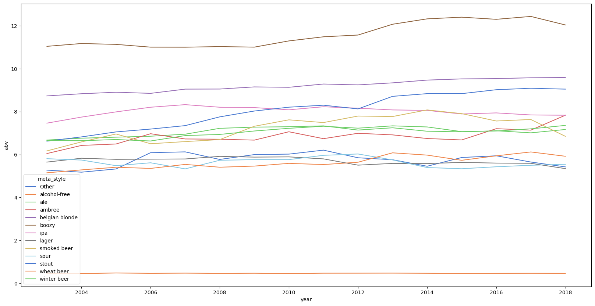
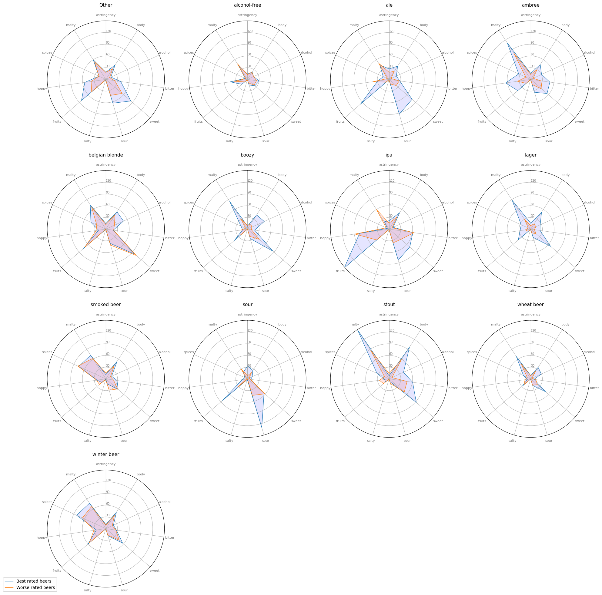

# Project of Data Visualization (COM-480)

| Student's name | SCIPER |
| -------------- | ------ |
| Nicolas Termote | 301581|
| Michel Morales | 283657 |
| ~~Edouard Dufour | 295754~~ |

## Website

[World Of Beer Website](https://com-480-data-visualization.github.io/project-2023-viz-ionaries/)

[Milestone 1](#milestone-1) • [Milestone 2](#milestone-2) • [Milestone 3](#milestone-3)

## Milestone 1 (23rd April, 5pm)

**10% of the final grade**

This is a preliminary milestone to let you set up goals for your final project and assess the feasibility of your ideas.
Please, fill the following sections about your project.

*(max. 2000 characters per section)*

### Dataset

> Find a dataset (or multiple) that you will explore. Assess the quality of the data it contains and how much preprocessing / data-cleaning it will require before tackling visualization. We recommend using a standard dataset as this course is not about scraping nor data processing.
>
> Hint: some good pointers for finding quality publicly available datasets ([Google dataset search](https://datasetsearch.research.google.com/), [Kaggle](https://www.kaggle.com/datasets), [OpenSwissData](https://opendata.swiss/en/), [SNAP](https://snap.stanford.edu/data/) and [FiveThirtyEight](https://data.fivethirtyeight.com/)), you could use also the DataSets proposed by the ENAC (see the Announcements section on Zulip).

We decided to use two datasets from Kaggle in the topic of beer. These two datasets put together give us a lot of useful information concerning the beer types, breweries, aromatic profiles and rating. These datasets are organized as follows :

#### 1- [Breweries, reviews : ](https://www.kaggle.com/datasets/ankurnapa/brewery-dataset?select=beers.csv)

This dataset is made up of three files, the data seems to be well organized and clean, with consistency in each column (string format, etc.). Little to no pre-processing of the columns will be needed.

The data is from 1996 to 2018, and contains 9'073'128 reviews of 358'873 beers from 50'347 breweries. The data is organized as follows :

- beers.csv (358'873 entries): 
    - id : beer tag
    - name : beer name
    - brewery_id : brewery tag
    - state : state of origin
    - country : country of origin
    - style : beer style
    - availability : seasonal availability of the beer
    - abv : Alcohol by Volume
    - notes : notes about the beer
    - retired : Whether the beer is still produced

- breweries.csv (50'347 entries) :
    - id : brewery tag
    - name : brewery name
    - city : city of origin
    - state : state of origin
    - country : country of origin
    - notes : notes about the brewery
    - types : type of establishment (Brewery, Bar, etc.)

- reviews.csv (9'073'128 entries) : 
    - beer_id : beer tag
    - username : username of the reviewer
    - date : date of the review
    - text : text of the review
    - look : look score
    - smell : smell score
    - taste : taste score
    - feel : feel score
    - overall : overall score
    - score : average of the scores for this beer

#### 2- [Beer Aromas (Tasting profiles): ](https://www.kaggle.com/datasets/stephenpolozoff/top-beer-information)

A dataset of up to 50 top-rated beers across 112 styles, 5558 beers in total. This data comes from BeerAdvocate, a website that allows users to rate and review beers. The data is also well organized and clean, with consistency in each column (string format, etc.). Little to no pre-processing of the columns will be needed.

- beer_data_set.csv (5558 entries) :

    - Name : Beer name
    - key : Unique key given to each beer
    - Style : Beer style
    - Style Key : Unique key given to each style
    - Brewery : Beer's source brewery
    - Description : Information on the beer
    - ABV : Alcohol by Volume
    - Ave Rating : Average rating of a beer
    - Min IBU : Minimum value for IBU (International Bitterness Unit), a measure for bitterness
    - Max IBU : Maximum value for IBU
    - Astringency : Astringency tasting score
    - Body : Body tasting score
    - Alcohol : Alcoholic tasting score
    - Bitter : Bitterness  tasting score
    - Sweet : Sweetness tasting score
    - Sour : Sourness tasting score
    - Salty : Saltiness tasting score
    - Fruits : Fruity tasting score
    - Hoppy : Hoppy tasting score (Herbal and floral, taste of hops)
    - Spices : Spiciness tasting score
    - Malty : Maltiness tasting score

The merging of the two datasets will be done by matching the beer names, brewery names and alcohol level. This will allow us to have a single dataset with all the information we need. The final merged dataset contains 4135 beers and 1744151 reviews.

### Problematic

> Frame the general topic of your visualization and the main axis that you want to develop.
> - What am I trying to show with my visualization?
> - Think of an overview for the project, your motivation, and the target audience.

Our problematic is to identify the key factors that contribute to a beer's popularity and how those factors vary by beer style, flavor profile, and brewery.

We will explore which beer styles are the most popular among consumers and how their flavour profiles differ from one another, and if a certain flavour profile has better reviews in each style. We will also analyze how consumers' reviews vary by beer origin and whether certain breweries have a better reputation than others. We could also look at how review trends can affect the popularity of certain beer types, or if seasons have an effect on beer preference by consumers

Our motivation for this project is to help beer enthusiasts and industry professionals gain a deeper understanding of the beer market and consumer preferences. We believe that our findings will be useful for brewery owners, beer distributors, beer critics, and consumers who are interested in learning more about different beer styles and flavour profiles.

### Exploratory Data Analysis

> Pre-processing of the data set you chose
> - Show some basic statistics and get insights about the data

This analysis can be seen in the file : Exploration.ipynb

### Preprocessing

We started by preprocessing the data. We merged the datasets by inner-joins, getting a single dataset with beer, brewery and aroma information. We one-hot encoded the brewery type. We also added the medians of the review-scores for the beers that had reviews.
We kept only the reviews of the beers that are in the final dataset. Finally, we added what we called "meta-styles", which are broader categories than the given styles, so that we could extract interpretable visualizations. The preprocessing can be found in the "Preprocessing" notebook.

### Analysis

#### Beer style per country

We compared the average rating of beer styles, grouping them by country. 

Without surprise, the belgians seem to be making the best Belgian Blonde, but not by far ! We can also see that Lager beer seems to be less liked for every country. Oddly enough (or not) Alcohol-free beers seem to be have less success. Even weirder, Great Britain seems to have the best Alcohol free beers by far. They are the only country to make better non-alcoholic beer than some of the alcoholic types.

#### Alcohol trend

Speaking on the impact of alcohol, we wanted to see if there is a trend on the alcohol content of beers.

It appears that there is no general trend in alcohol content in general. Nevertheless, some types of beer seem to have a steady in increase in alcohol volume, like stouts or ambree. Some beers seem to have lost some alcohol content like smoked beers or IPAs. Most of the other types of beer have kept similar alcohol contents. So it might seem that making beers more alcoholic is not the only factor to make good beers !

#### Tastes in each beer type

We made a spider plot of the aromatic profile of the average 50 best and 50 worst beer per style. The blue is representing the average of the top 50 beers while the orange represents the average worst 50 beers.

The general trend is that beers that have the most 'character' are more preferred. Indeed, most of the time the worst beers seem to have less aroma.

A notable trend is that fruity beers seem to be very well liked by the reviewers. Also, IPAs are supposed be hoppy beers but somehow the worst rated IPAs are the one who have a hoppy taste. Here we can clearly see that brewers have adapted the IPA genre to the consumer's tastes

### Related work

> - What others have already done with the data?
> - Why is your approach original?
> - What source of inspiration do you take? Visualizations that you found on other websites or magazines (might be unrelated to your data).
> - In case you are using a dataset that you have already explored in another context (ML or ADA course, semester project...), you are required to share the report of that work to outline the differences with the submission for this class.

We have found on Kaggle [an analysis on what matters the most for beer reviewers](https://www.kaggle.com/code/stpeteishii/beer-information-visualize-importance#Visualize-Importance). 

Our approach differs in the fact that we intend to make more use of flavours related to each type of beer, not simply stating what works in general. Someone who likes sour beer might not be the person most interested by heavily malted beer. We also use information about beer trends by country and season, and we intend to make use of the brewery information to see if there are any trends in the beer industry. The merging of all these datasets will allow us to make more interesting visualizations, and have a more specialized view by beer style. 

Our inspiration comes from a common passion among our group, as members of Satellite we participated in multiple beer tastings and brewery presentations through the year. We believe that this analysis will not only help us broaden our understanding of the industry, but it will also help up take pertinent choices in the future of our association. 

## Milestone 2 (7th May, 5pm)

**10% of the final grade**

This milestone can be found in the `Dataviz_Milestone 2.pdf` file.

## Milestone 3 (4th June, 5pm)

**80% of the final grade**

## Late policy

- < 24h: 80% of the grade for the milestone
- < 48h: 70% of the grade for the milestone

